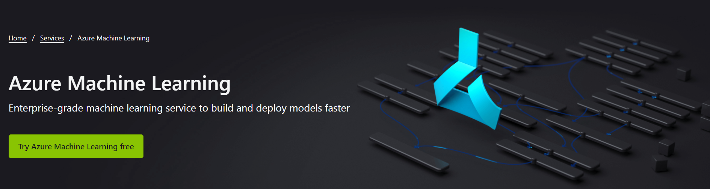

# Green Solutions with Azure Machine learning

*The article covers the green solutions that can be possible with the help of azure machine learning. The blog is part of the green daily series.*

  

<!-- #### ---<Starting from the issues and then ml and azure and then solutions> -->

Climate, agriculture, and oceans are some of the *green tags* where humanity is working together for reviving and solving the challenges that are already over the edge. Climate crisis, endangered species, marine lives, carbon emissions, pollution, agricultural efficiency, etc. are some of the challenges.
Climate change is the biggest challenge in front of humankind and several efforts have been recorded in past.

If we look out for technological tools & solutions that are part of those efforts, machine learning has always been the count.

<!-- From what we've seen, it seems to be a very common trend to pick up new words that we hear all around us and use them in our own conversations to feel updated ! This is very common in the field of technology too !! -->

Now, to ***really*** update ourselves, we must truly understand what the word means, right ?
With that said, let's have a walk around one amongst the busiest words of the 21st Century in the field of technology,
and you guessed it right, it is ***Machine Learning***. 🌟

# What is Machine Learning ❔

***Machine Learning (ML)*** belongs to the field of ***Artificial Intelligence (AI)***, which deals with predictions, learning through present data and making the machine act without being explicitly programmed.

<!-- which provides computer systems with the ability to automatically learn and improve from experience without being manually programmed>. It's as if we're trying to build a scaled-down version of the ***human brain*** or a part of it, thus providing our computer with the ability to think, learn and take decisions on its own. -->

   

Now, if you've been in the field for quite some time, you would have heard of ML and related ***ML Algorithms***. Machine learning uses algorithms to identify ***patterns*** within data and those patterns are then used to create a data ***model*** that can make predictions. With increased data and experience, the results of machine learning will be much more accurate like how humans improve with more practice.

Okay, all of this seems great right ? So, where's the catch ❔❔ 

The catch is when you've got to take immense time and effort in building an ***ML Model***. It's not always easy to gather the required ***Datasets*** to build a model, which equally agrees with the efforts of having to learn various ML Algorithms and choose the best, which then needs further optimization. There is also a lack of apt ***hardware*** on all devices needed to run heavy models and finally, the most important of these problems - Stackoverflow isn't your best friend when it comes to ML Models, as your use case might be very specific, not commonly found on the internet, ah that's difficult? right?

   

Well, so where's the solution ? Don't you worry, ***Microsoft Azure Machine Learning*** has got you covered !! 🛡️

# Azure Machine Learning 🧠

Before we get started with Azure's Machine Learning Services, let's talk a little about ***Azure***.

The ***[Azure](https://azure.microsoft.com/en-us/)*** Cloud Platform provides more than ***200 products and cloud services*** designed to help you bring new solutions to life to solve today’s challenges and create the future. It helps you build, run and manage applications across multiple clouds, on-premises and at the edge, with the tools and frameworks of your choice.

Amongst the various products and services offered by Azure, the one we're helping you master is called ***Azure Machine Learning Services***. 🧠

  

Before we deep dive into why you should consider using Azure ML in your end products, let's take a quick tour on the process of building an ML model. You would likely follow the steps mentioned below in order :-  

## The Normal Way 💻

1. **Import/Create a ***Dataset***** - Based on your problem statement,  you are likely to either build a dataset or pick one up from the internet.
2. **Prepare Data** - Perform Data Augmentation, remove possible noise and preprocess data present in the dataset and sort/classify them into ***Training and Testing Data***.
3. **Build the Model** - Create an ML model with an analyzed choice of - ***Input size, Normalized inputs, No. of hidden layers, Core algorithm, Overfitting reduction procedures, Output size and a threshold Accuracy level.***
4. **Train the Model** - Train the created model with previously created training data.
5. **Validate the Model** - Use the testing data to measure the model for ***Accuracy Parameters*** based on threshold conditions.
6. **Save the Model and Deploy** - Finally, save the model you just created for further deployment on your end applications. 🌟 

Now that we've laid out the entire process, allow us to show you how Azure ML changes your development lifecycle ❗ 

   

## The Azure ML Way 🪟

1. **Access Pre-Built Datasets/Import your own** - Pick up one of the prebuilt databases or import one of your own. Managing data has never been easier with ***Azure's strong cloud infrastructure***, supported by compatibility with various databases - ***Azure CosmosDB or other third party databases***.
2. **Build and Train Models** - Use ***Visual Studio Code and GitHub*** to make your task of building the model smoooooooth along with capabilities to ***Automatically train and tune accurate models***, along with built-in support for all Open-source libraries and frameworks - Scikit-learn, PyTorch, etc.
3. **Validate and Deploy** - Train and deploy models on Azure's robust infrastructure with ***Automated Pipelines and CI/CD***, as well as gain access to containers filled with Pre-built images and model repositories to share and track progress.
4. **Manage and Monitor** - Track, log, and analyze your models, backed up by a plethora of security services and error analyzers. 🥇 

If we've still got out math skills right, we notice we've not only managed to reduce the stages of developing a ML Model, but have managed to do so by adding various robust and highly useful functionalities in the process ! 🧮 

Here's a statistical overview for you math geeks out there.

   

Now, Let's talk you through a few more features of Azure ML.

## Features of Azure ML 🌟

1. **Ease of use with a morale boost** - Azure ML has been designed to boost your productivity and help you achieve the most out of yourself. Features such as ***Collaborative Notebooks, Intellisense, Easy compute and Kernel Switching alongside Visual Studio Code and GitHub thereby enabling source control*** offer a rich and immersive development experience.
2. **Plethora of ML development aids** - Azure ML offers a plethora of supporting tools such as ***Drag and Drop Machine Learning, Rapid Automation in Model creation, Model Interpretability alongside Robust and automated testing mechanisms*** and a lot more !.
3. **Security** - Azure ML provides for model training transparency to improve model reliability and help take quick actions in identification and diagnosis of errors. It also provides for a central registry to store and track model data and metadata, with further options for model development, training and testing log metrics. Not to mention the robust security services offered by Azure which has always got you and your data protected and shielded. 🛡️
4. **Infrastructure** - Azure ML has always got you covered in case your ML model is bombarded with processing requests. To do this, it uses ***Autoscaling Compute - helps you scale up allocated resources dynamically by either sharing CPU and GPU clusters or by allocating additional resources, provided you've left a few pennies on your Azure account.***

That's a lot of features !! Now, let's look into how Azure ML finds it's way to ***Green Technologies***.

# Green solutions and Azure ML

By green solutions we mean a vast range of technological solutions that are part or can possibly facilitate the efforts and actions.

- If we look at climate actions and efforts, models can help hugely in the part of predictions with the existing data or building and deploying end- to-end pipeline for real time predictions and results.
- Like having models to predict the gaseous release in s forest, which is a result of wild fire, before it gains momentum and spread.
- In agriculture, we can use models to predict the land fertility or providing details on what should be cultivated for what soil type...

In the next few blogs in this series we will walk through some solutions and see it working with help of Azure ML services. 

---
