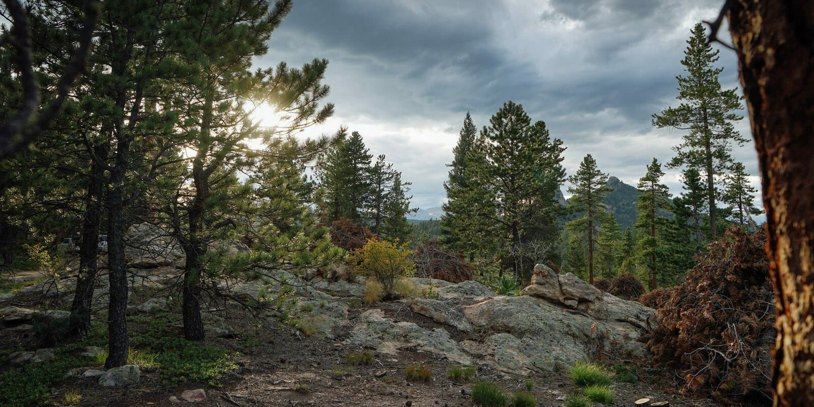
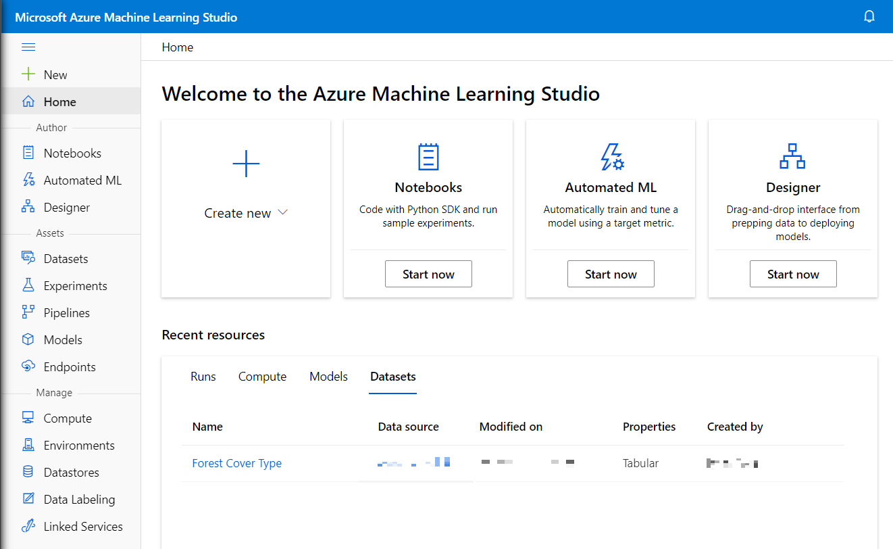
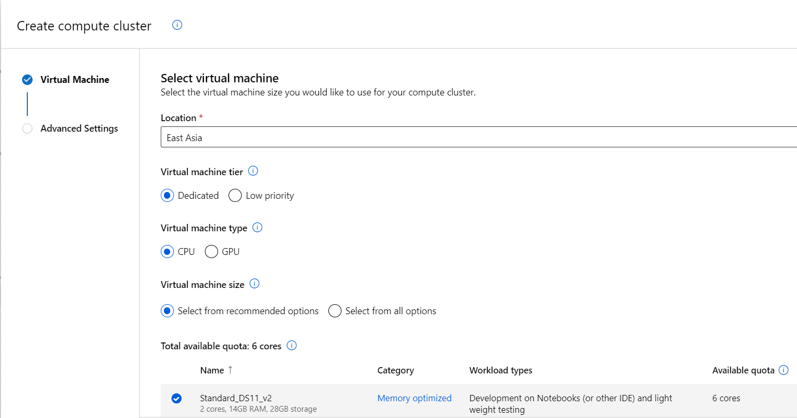
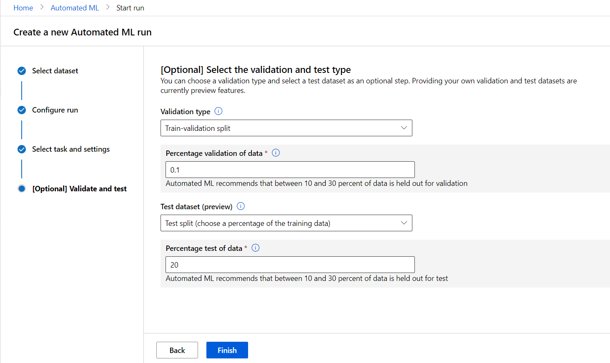
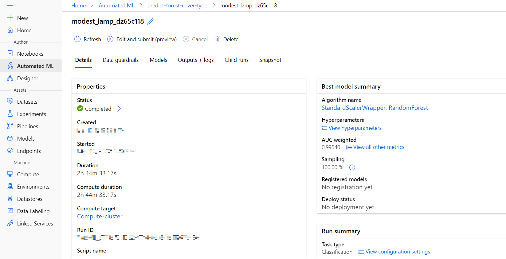
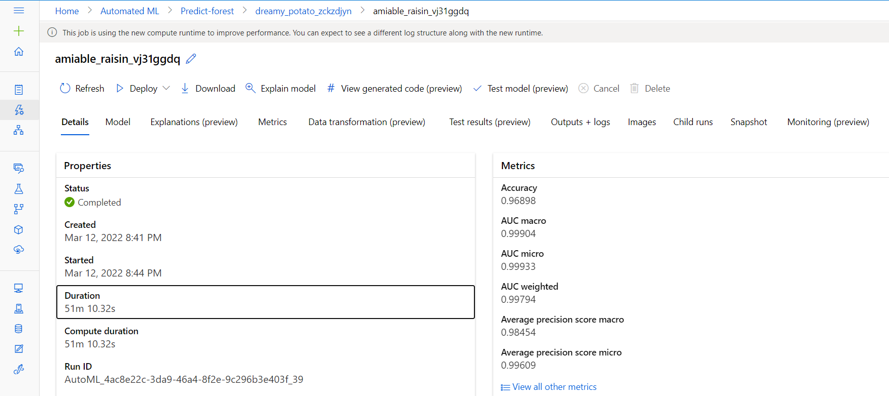
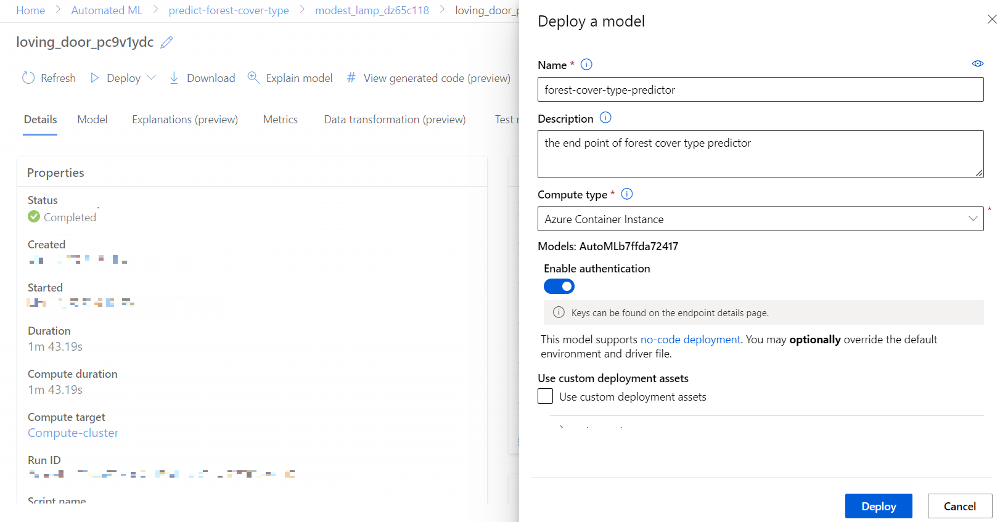
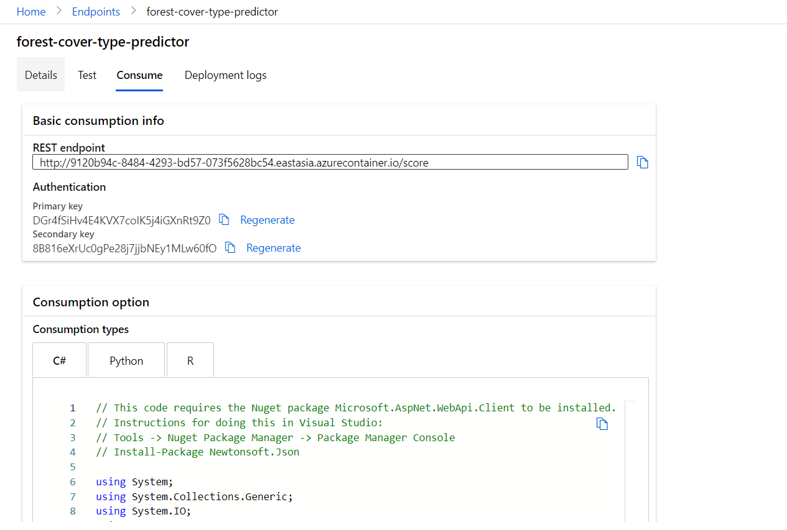

# How Automated ML helps decide Forest Cover Type?

## Let me tell a story (Fiction) 🌳
*The Green Team* spent half of an year collecting data of **forest cover types** and their geographic information (elevation, slope, solid, etc.). They want to build a machine learning model using these data, which output the suitable forest cover type with given geographic features. But **they have little programming experience, and only know basic ideas of machine learning**.  
Fortunately, they reach out for **[Azure Automated ML](https://azure.microsoft.com/en-us/services/machine-learning/automatedml/#features)**.

## What is Automated ML? 🤖
**[Azure Automated ML](https://azure.microsoft.com/en-us/services/machine-learning/automatedml/#features)** empowers you to build amazing machine learning models and applications rapidly without any code. It rapidly iterates over many combinations of algorithms and hyper-parameters to help you find the best model based on the metric of your choosing.

With Azure Automated ML, you will:
* Build models your way
* Control the model building process
* Improve productivity with automatic feature engineering
* Understand models better

## Let's walk through how *The Green Team* solved their problem. 🐾

*The Green Team* used **Azure Automated ML** to build a **Forest Cover Type Predictor** model. It predicts the suitable forest cover type based on geographic features.

### Step 1: Create ***Compute Resource*** 💻

**Azure Machine Learning** is a platform for training and managing machine learning models, and we need compute to run the training process.  
*The Green Team* navigated to [Azure Machine Learning Studio](https://ml.azure.com/), and under **Compute** page, creating a **Compute Cluster** resource.

### Step 2: Upload ***Dataset*** 🧊

> This dataset comes from [UCI Machine Learning Repository](https://archive.ics.uci.edu/ml/datasets/Covertype). You can check out the website for more details.

In Azure Machine Learning, data for model training and other operations is usually encapsulated in an object called a dataset.

*The Green Team* entered the **Datasets** page, uploading their own dataset with following settings:
* **Basic info**
  * **Name**: Forest Cover Type Dataset
  * **Dataset type**: Tabular
  * **Description**: forest cover type data
* **Datastore and file selection**
  * **Select or create a datastore**: default setting
  * **Select files for your dataset**: upload [covtype.csv](./covtype.csv).
* **Settings and preview**
  * **File format**: Delimited
  * **Delimiter**: Comma
  * **Encoding**: UTF-8
  * **Column headers**: All files have same headers
  * **Skip rows**: None
  * **Dataset contains multi-line data**: Not selected
* **Schema**
  * Include all columns other than Path
  * Review the automatically detected types
* **Confirm details**
  * Do not profile the dataset after creation
  

### Step 3: Start an Automated ML experiment 🔨

The automated machine learning capability in **Azure Machine Learning** supports supervised machine learning models - in other words, models for which the training data includes known label values. You can use automated machine learning to train models for:  
* **Classification**: predicting categories or classes
* **Regression**: predicting numeric values
* **Time series forecasting**: predicting numeric values at a future point in time

As all the forest cover types is labeled as an integer from 1 to 7, this is a typical **Classification Task**. *The Green Team* create a ***New Automated ML run*** in **Automated ML** page with following settings:

* **Select dataset**:
  * Forest Cover Type Dataset
* **Configure run**:
  * **New experiment name**: predict-forest-cover-type
  * **Target column**: Cover_Type \(this is the label that the model is trained to predict\)
  * **Select compute cluster**: the compute cluster created previously
* **Select task and settings**:
  * **Task type: Classification** (the model predicts categories or classes)
  * **Enable deep learning**: selected
* **Additional configuration settings**:
  * **Primary metric**: AUC weighted
  * With other as default
* **Validation type**
  * **Train-validation split**
    * **Percentage validation of data**: 10
  * **Test dataset**: Test split (choose a percentage of the training data)
    * **Percentage test of data**: 20

The experiment started automatically. *The Green Team* then took a rest, waiting for the result of model training.

### Step 4: Review the best model 🥇

A few hours later, the experiment finished with the best model (other models are available as well). *The Green Team* checked this awesome model in the *Details* tab. 

**Clicking the best model's name** (StandardScalerWrapper, RandomForest), they got more information -- explanations, metrics, etc. -- about the model.  

The **top-4 important features** of model are Elevation, Hillshade_9am, Horizontal_Distance, and Hillshade_3pm. These might be the dominant features that deciding forest cover type.

In *Metrics* tab, they got more details of metric, like [ROC](https://en.wikipedia.org/wiki/Receiver_operating_characteristic) and [Confusion Matrix](https://en.wikipedia.org/wiki/Confusion_matrix).

### Step 5: Deploy a model as a service 📢

**Training model is not the end** of a machine learning task. **Deploying model** as a service making this awesome work **available to everyone**! 

In best model's detail page, *The Green Team* **Deployed it to web service** with following settings:
* Name: forest-cover-type-predictor
* Description: the end point of forest cover type predictor
* Compute type: Azure Container Instance
* Enable authentication: selected

It took few minutes to deploy this model (deployment state became *Healthy*). In the **Endpoints** page, *The Green Team* get the RESTful API under **Consume** tab.

After using API's in their web service, *The Green Team* provides **Forest Cover Type Predictor** around the world.
